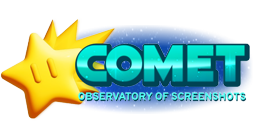

# Comet

An all-in-one screenshot manager for the 3DS — browse everything in a
grid, preview 3DS captures in real stereoscopic 3D, manage DS
screenshots straight out of nds-bootstrap's tar, filter by type or
date, and copy or delete individually or in batches.

Named after the Comet Observatory from *Super Mario Galaxy*, keeping
with the Luma/Rosalina naming theme.

## Features

- **Grid browsing:** a real 4×4 grid of thumbnails, not a list, with
  both D-Pad and touch navigation
- **Live stereo 3D preview:** the top screen shows whatever's
  highlighted, in real glasses-free 3D for 3D-capable screenshots
- **Copy to the 3DS Camera album:** writes proper `.MPO` files for 3D
  pairs (with the MPF/EXIF tags the Camera app actually checks for)
  and plain `.JPG` for 2D screenshots, individually or in batch
- **Delete**, individually or in batch, always with a confirmation step
- **Filter** by All / 3D Only / 2D Only, or drill into a specific
  Year → Month → Day
- Peek at Luma's bottom-screen capture alongside any screenshot
- **DS mode:** press L+R to switch to browsing DS screenshots taken
  with nds-bootstrap/TWiLightMenu++. Reads `screenshots.tar` directly,
  with separate tabs for what's still in the tar and what's already
  extracted to SD — view, filter, copy, and delete from either, with
  safe extraction (individually or all at once) and widescreen support
  for games with a 16:10 patch. See [CHANGELOG.md](CHANGELOG.md) for
  the details.
- A visual style modeled on the Switch's Album app, right down to
  sound effects for key actions

## Installing

Grab the latest release from the
[Releases page](../../releases/latest):

- **`Comet.cia`** → installs to your HOME Menu with its own icon and
  banner. Needs a CFW with patched signature checks (Luma3DS, which
  you already have if you're using Rosalina screenshots) and an
  installer like [FBI](https://github.com/Steveice10/FBI). Can also be
  installed via QR code through FBI's Remote Install feature.
- **`Comet.3dsx`** → copy to `sdmc:/3ds/Comet/Comet.3dsx` and launch
  from the Homebrew Launcher. No install needed.

## Building from source

See [BUILDING.md](BUILDING.md) for full toolchain setup and build
instructions (both `.3dsx` and `.cia`).

## Credits
- Made with [Claude](https://claude.ai/) by Anthropic 
- Built with [devkitPro](https://devkitpro.org/)/libctru/citro2d/citro3d
- Body font: [Poppins](https://fonts.google.com/specimen/Poppins) by
  Indian Type Foundry (SIL Open Font License)
- JPEG encoding via [stb_image_write](https://github.com/nothings/stb)
  by Sean Barrett
- The Morton/Z-order GPU texture swizzle is sourced from the
  [Citra](https://github.com/PabloMK7/citra) emulator's own code,
  since it has to be byte-exact to render real games correctly

See [TECHNICAL.md](TECHNICAL.md) for the deeper build notes. The MPO
format internals, the background-threaded texture pipeline, and a
handful of hardware quirks that took real effort to track down.

## Troubleshooting

If your exported screenshots don't appear in the 3DS Camera app, that's
because the management file isn't automatically refreshed when files
are added directly to the SD card.

**How to fix:**
- Open the **Camera app** → **Settings**.
- Choose **Data Management** → **SD Card to System**.
- You can safely ignore the warning saying *"Videos saved on an SD
  Card cannot be copied to the System Memory."* Press **OK**.
- On the next warning, *"Some photos may not be copied. Is this OK?"*
  press **No**.
- If you see *"The management file will now be updated. This may take
  some time,"* it worked — you can exit Settings now.
- If not, try again.

## License

MIT — see [LICENSE](LICENSE). Poppins and `stb_image_write.h` carry
their own separate licenses; see the note in
[TECHNICAL.md](TECHNICAL.md#license-details) for specifics.
